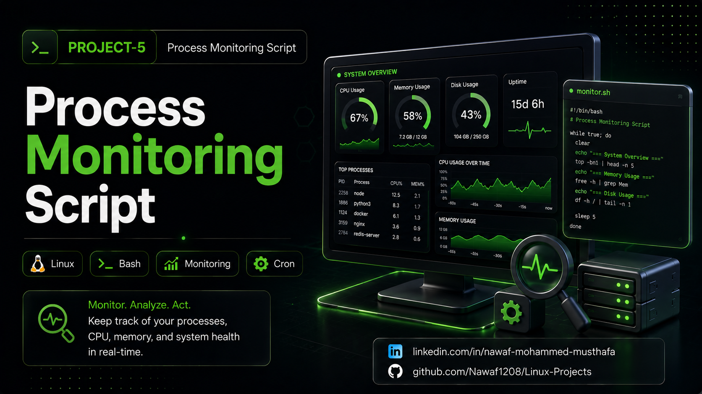

# Process Monitoring Script (Bash)




A lightweight Linux monitoring utility that identifies processes exceeding configured CPU and memory usage thresholds. The script logs high resource consumption with timestamps and provides a clean terminal dashboard for quick monitoring.

## Monitoring Features
- **CPU Monitoring**: Detects processes exceeding the configured CPU usage threshold.
- **Memory Monitoring**: Detects processes exceeding the configured memory usage threshold.
- **Threshold Configuration**: Easily customize CPU and memory usage limits.
- **Activity Logging**: Records high resource usage events with timestamps.
- **Host Information**: Displays the system hostname and current date.
- **Terminal Dashboard**: Presents monitoring information in a clean and readable format.

## Project Structure
- **Monitoring.sh**: Main Bash script responsible for monitoring processes.
- **monitoring.log**: Stores detected high CPU and memory usage events.
- **README.md**: Project documentation and usage instructions.
- **.gitignore**: Prevents generated log files from being tracked by Git.

## Getting Started

### Prerequisites
- Linux Environment
- Bash Shell
- Standard Linux utilities:
  - `ps`
  - `awk`
  - `hostname`
  - `date`

### Installation

1. Navigate to the project directory:

```bash
cd linux-projects/process-monitoring-script
```

2. Make the script executable:

```bash
chmod +x Monitoring.sh
```

## Usage

Run the script:

```bash
./Monitoring.sh
```

The script will:

- Check running processes for high CPU usage.
- Check running processes for high memory usage.
- Log processes exceeding configured thresholds.
- Display monitoring information in the terminal.

## Verification

### View monitoring log

```bash
cat "$HOME/monitoring.log"
```

### Monitor processes manually

CPU Usage:

```bash
ps -eo pid,comm,%cpu --sort=-%cpu
```

Memory Usage:

```bash
ps -eo pid,comm,%mem --sort=-%mem
```

## Configuration

Modify these variables inside the script:

```bash
CPU_THRESHOLD=80
MEMORY_THRESHOLD=80
LOG_FILE="$HOME/monitoring.log"
```

## Cleanup

Remove the monitoring log:

```bash
rm -f "$HOME/monitoring.log"
```

## Example Log

```text
[Thu Jul 09 10:42:15 UTC 2026] High CPU: PID=2154 Process=chrome CPU=92.4%

[Thu Jul 09 10:42:16 UTC 2026] High Memory: PID=2154 Process=chrome MEMORY=81.3%
```

## License

This project is intended for learning, portfolio building, and Linux administration practice.
