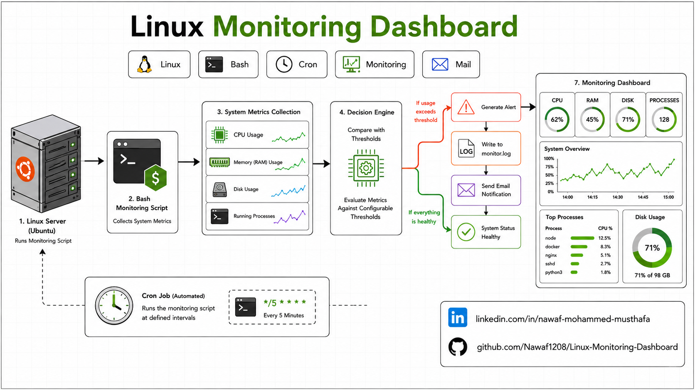
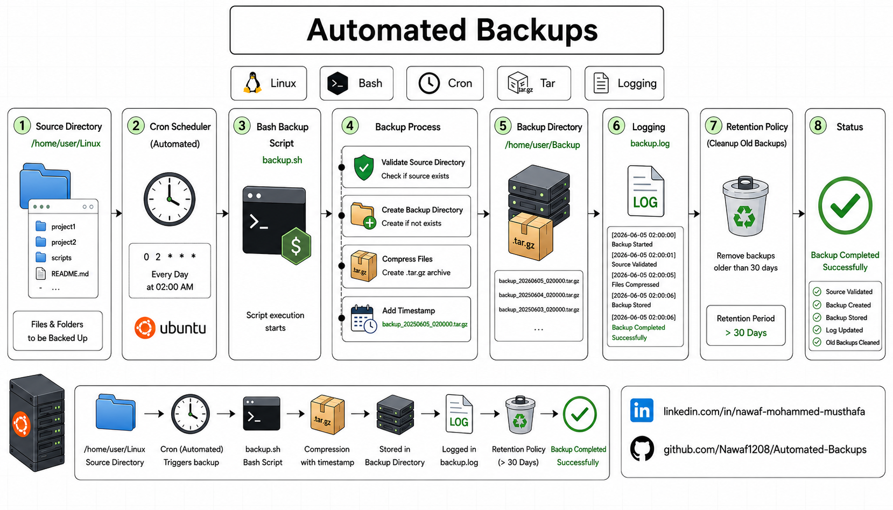
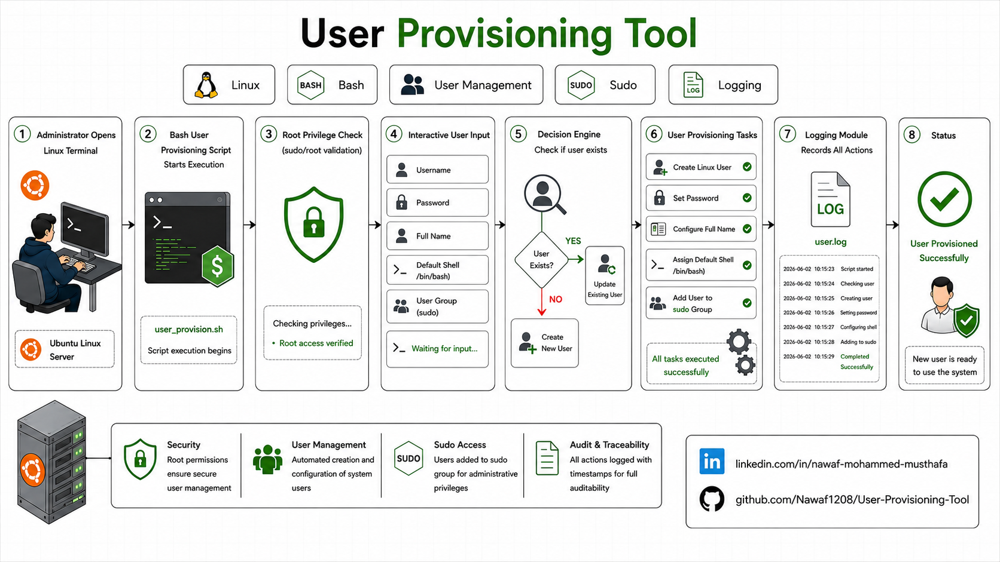
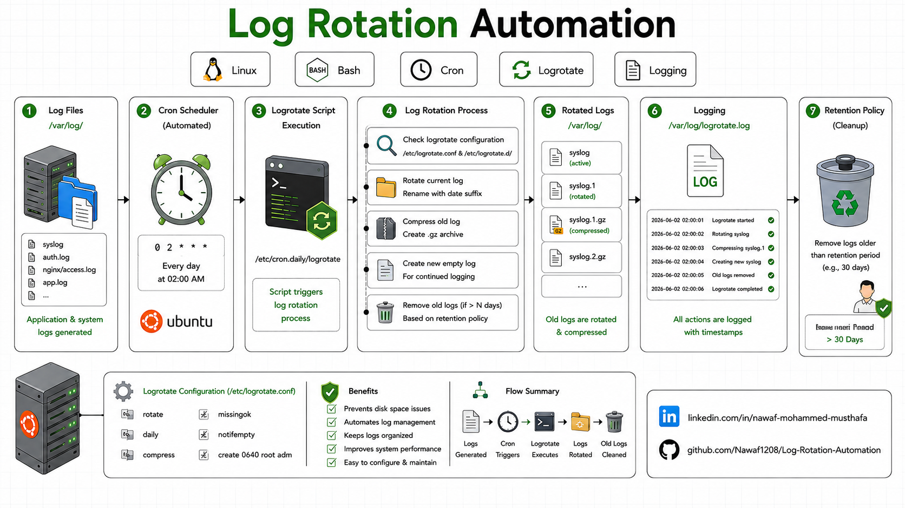
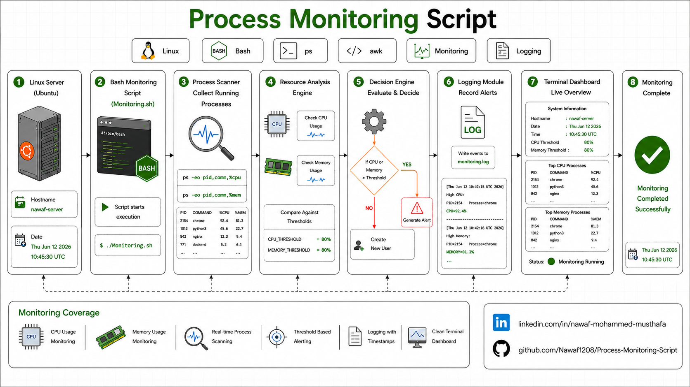

# Linux Projects

A collection of Linux administration and Bash scripting projects built while learning Linux fundamentals for DevOps. Each project focuses on solving real-world system administration tasks through automation, monitoring, logging, and user management using standard Linux utilities.

---

## Projects

### 1. Linux Monitoring Dashboard

A terminal-based system monitoring dashboard that displays CPU, memory, disk usage, running processes, and system information while logging resource utilization.

**Project Repository**

🔗 <https://github.com/Nawaf1208/Linux-Monitoring-Dashboard>

**Key Features**

- CPU, Memory & Disk Monitoring
- Resource Threshold Alerts
- System Information Dashboard
- Process Monitoring
- Logging

---

### 2. Automated Backups

A backup automation utility that creates compressed backups of a directory, logs backup operations, and removes backups older than the configured retention period.

**Project Repository**

🔗 <https://github.com/Nawaf1208/Automated-Backups>

**Key Features**

- Automated Compressed Backups
- Timestamped Backup Files
- Backup Logging
- Retention Policy
- Automatic Cleanup

---

### 3. User Provisioning Tool

A Linux administration utility that automates user creation with home directories, default shell assignment, group management, secure password configuration, and provisioning logs.

**Project Repository**

🔗 <https://github.com/Nawaf1208/User-Provisioning-Tool>

**Key Features**

- User Creation
- Home Directory Creation
- Group Assignment
- Secure Password Setup
- Activity Logging

---

### 4. Log Rotation Automation

A Bash utility that compresses old log files and removes compressed archives after a configurable retention period to help manage disk usage.

**Project Repository**

🔗 <https://github.com/Nawaf1208/Log-Rotation-Automation>

**Key Features**

- Automatic Log Compression
- Archive Cleanup
- Configurable Retention
- Rotation Logging

---

### 5. Process Monitoring Script

A lightweight monitoring utility that detects processes exceeding CPU and memory thresholds and records them into a monitoring log.

**Project Repository**

🔗 <https://github.com/Nawaf1208/Process-Monitoring-Script>

**Key Features**

- CPU Monitoring
- Memory Monitoring
- Threshold Configuration
- Monitoring Logs
- Terminal Dashboard

---
